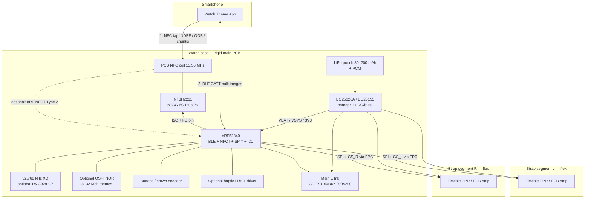
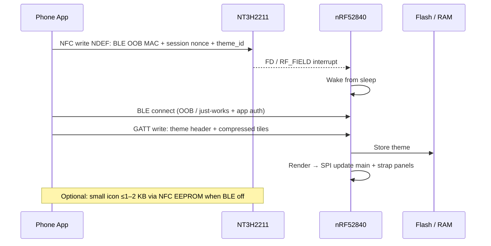

> **KiCad project note (2026-09-18):** для схемы в этой папке **NFC снят** (BLE-only pairing). См. корневые `../README.md` и `../DESIGN_NOTES.md`.

# Architecture — E Ink Watch PCB

## 1. System block diagram



## 2. Mechanical topology: rigid + flex (recommended)

**Decision: main rigid PCB in the case + flex tails to strap displays — not all-in-one.**

| Approach | Pros | Cons |
|----------|------|------|
| **A. Rigid case PCB + 2× flex FPC to straps (chosen)** | Battery/MCU/NFC stay shielded; strap bend only on display FPC; easier RF; replaceable straps | Need FPC connectors / board-to-board; ZIF on both sides of case |
| B. Rigid-flex single panel into straps | Fewer connectors | Costly; NFC/battery constrained by flex; hard rework |
| C. All electronics in buckle + long SPI | Thin case | High EMI on long SPI; power drop; weak NFC UX near face |

```
         [ strap EPD L ]====FPC====[ CASE: main PCB + battery + main EPD ]====FPC====[ strap EPD R ]
                                      |  USB / wireless charge pad  |
```

- Main E Ink sits above or beside the PCB (FPC folded).
- Battery under PCB or beside display (thickness tradeoff — **needs user case thickness**).
- NFC coil: on PCB under non-metal back, or on flex under polymer crystal — **not under metal bezel**.

## 3. Display topology

### Main face (~1.2–1.5″)

| Priority | Part family | Notes |
|----------|-------------|-------|
| Primary (mono, available) | Good Display **GDEY0154D67** / Waveshare 1.54″ 200×200 B/W, SSD16xx, SPI | Square AA ~27.6×27.6 mm; partial refresh |
| Smaller | **GDEM0122T61** 1.22″ 176×192 B/W | Fits tighter cases |
| Round desire | COTS **round mono E Ink is scarce** | Options: custom from Good Display / E Ink; or **1.69″ round Spectra 6 GDEH0169E01** (color, not mono); or Sharp Memory LCD LS013B7DH03 (reflective mono, not E Ink) |

Shared SPI bus: `SCK`, `MOSI` common; per-panel `CS`, `DC` (or shared DC), `BUSY`, `RST`.

### Strap strips ×2

| Priority | Part family | Notes |
|----------|-------------|-------|
| Prototype | Waveshare **2.13″ Flexible** 212×104, ~59×29×0.3 mm panel | Proven in CHI 2020 Watch+Strap; housing must match strap width — panel is wider than many 20–22 mm straps |
| Production narrow | **Ynvisible** printed electrochromic (segmented) custom shape | Ultra-low power, arbitrary outline; not full bitmap graphics |
| Alternative | Custom cut / MOQ flexible EPD from panel makers | Lead time; min bend radius ~30–33 mm typical |

**Honest constraint:** true “narrow strip” full-graphic E Ink matching 18–22 mm strap width is mostly **custom**. For v1 prototype use 2.13″ flex in a wider fashion strap or accept segment ECD.

## 4. NFC data path for themes / images

### Why not NFC-only for full themes

| Fact | Implication |
|------|-------------|
| NT3H2111 user EEPROM ≈ **888 B**; NT3H2211 ≈ **1912 B** | One full 200×200 1-bit frame ≈ **5000 B** — does not fit |
| Pass-through SRAM = **64 B** chunks | Transferring 5–50 KB means hundreds of taps / long hold + host app orchestration |
| Phone OS NFC UX | Background write limits; iOS needs proper NDEF; user must keep watch in field |
| Speed | Type 2 writes are ms/page — OK for metadata, painful for galleries |

### Recommended protocol (hybrid)



**Roles:**

1. **NTAG I²C Plus** — passive store when battery dead; wake MCU on field; hold BLE address / bond hint / tiny icon / config JSON.
2. **nRF52840 NFCT** (optional second antenna or shared carefully) — SoftDevice Type 2 for Nordic samples; **prefer discrete NTAG for dual-interface EEPROM + FD pin** to avoid fighting SoftDevice NFC timing.
3. **BLE GATT** — bulk: RLE/1-bit packed bitmaps, or chunked PNG→dither on phone.

Capacity planning example:

- Main 200×200×1 bpp = 5000 B → ~2–3 KB with RLE for UI chrome.
- Strap 212×104×1 bpp ≈ 2756 B each.
- Theme pack of 3 panels ≈ 8–12 KB compressed → **BLE mandatory**.

## 5. Power tree

```
USB-C VBUS 5 V ──┐
                 ├──► BQ25120A / BQ25155
Wireless coil ───┘         │
                           ├──► BAT (LiPo + PCM) ◄── charge path
                           ├──► PMID / SYS → 1.8–3.3 V rails
                           │         ├── MCU VDDH / VDD
                           │         ├── Displays VCC (3.3 V during refresh)
                           │         ├── NFC VCC (NTAG)
                           │         └── Flash / haptic
                           └──► LDO_OUT (always-on tiny for RTC if external)
```

| Rail | Typical use | Notes |
|------|-------------|-------|
| VBAT | Battery sense, ship mode | PCM cuts on UV/OV/OC |
| SYS / PMID | System during charge | Power-path so watch runs while charging |
| 3V3_DISP | E Ink only when refreshing | MOSFET load switch — off between updates |
| 3V3_ALWAYS | MCU retention / RTC / NTAG | Microamps |
| VDD_nRF | Nordic DCDC enabled | Follow Nordic ref design |

**Sleep strategy:**

1. After time paint: put E Ink to deep sleep (datasheet command), gate display power.
2. nRF → System ON idle or System OFF; wake on RTC compare (1 min), BUTTON, NFC FD, BLE advertising interval long.
3. Minute tick: partial refresh HH:MM only; full refresh every N hours / on theme change to clear ghosting.

## 6. Optional blocks

| Block | When |
|-------|------|
| QSPI NOR (e.g. W25Q128 class) | Multiple themes offline |
| Haptic (DRV2605 + LRA) | Notifications — costs power |
| Crown (ALPS encoder) / 2–3 buttons | UX without touch (E Ink touch rare/expensive) |
| Fuel gauge BQ27421 | If BQ25120A without good SoC ADC; BQ25155 has ADC for crude SoC |
| USB-C CC + ESD | If wired charge; else wireless only + sealed case |

## 7. Open mechanical dependencies

See README — case OD, thickness, strap width, charge method, round vs square face. These gate antenna diameter, battery mm, and FPC length.
